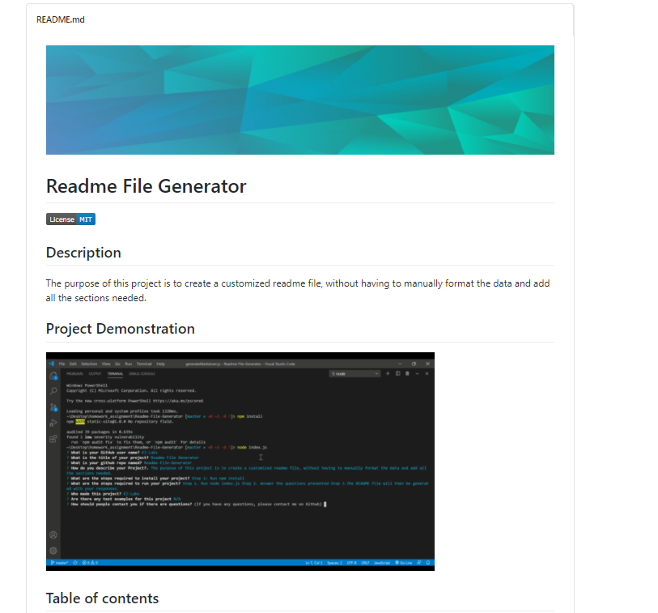

  
# Readme File Generator 

## Description 
The purpose of this project is to create a customized readme file, without having to manually format the data and add all the sections needed.

## Project Demonstration
  

## Table of contents

- [Description](#description)
- [Installation](#installation)
- [Usage](#usage)
- [License](#license)
- [Contributing](#contributing)
- [Tests](#tests)
- [Questions](#questions)
- [Repository Link](#repository)

## Installation

        Step 1: Run npm install

## Usage

        Step 1. Run node index.js Step 2. Answer the questions presented Step 3.The README file will then be generated with your responses.

## License
MIT 

2020 Permission is hereby granted, free of charge, to any person obtaining a copy of this software and associated documentation files (the Software), to deal in the Software without restriction, including without limitation the rights to use, copy, modify, merge, publish, distribute, sublicense, and/or sell copies of the Software, and to permit persons to whom the Software is furnished to do so, subject to the following conditions:The above copyright notice and this permission notice shall be included in all copies or substantial portions of the Software.THE SOFTWARE IS PROVIDED AS IS, WITHOUT WARRANTY OF ANY KIND, EXPRESS OR IMPLIED, INCLUDING BUT NOT LIMITED TO THE WARRANTIES OF MERCHANTABILITY, FITNESS FOR A PARTICULAR PURPOSE AND NONINFRINGEMENT. IN NO EVENT SHALL THE AUTHORS OR COPYRIGHT HOLDERS BE LIABLE FOR ANY CLAIM, DAMAGES OR OTHER LIABILITY, WHETHER IN AN ACTION OF CONTRACT, TORT OR OTHERWISE, ARISING FROM, OUT OF OR IN CONNECTION WITH THE SOFTWARE OR THE USE OR OTHER DEALINGS IN THE SOFTWARE.

## Contributing

The owner of this project is KJ-Labs, you're welcome to contribute.

## Tests

N/A

## Questions

- If you have any questions, please contact me on Github.
- email@gmail.com
- [KJ-Labs](https://github.com/KJ-Labs)

## Repository

- [Project Repo](https://github.com/KJ-Labs/Readme-File-Generator)

## Screenshots
  

